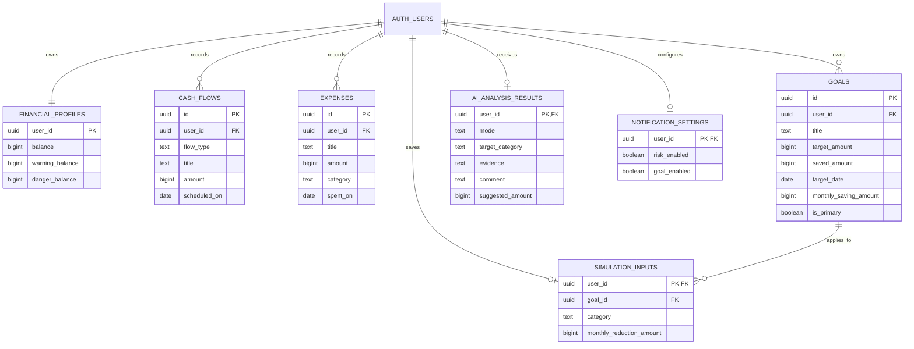

# 돈__조 데이터베이스 ERD

`5조_최종PRD.md`의 MVP 데이터 구조를 원격 저장용으로 옮긴 설계다. 금액은 원 단위 정수(`bigint`)로 저장하고, 미래 잔액·재정 상태·목표 예상 달성일은 PRD대로 앱 코드에서 계산한다.

## 설계 원칙

- `auth.users`는 Supabase가 제공하는 사용자 원본 테이블이다. 앱 데이터의 `user_id`는 이를 참조하며 모든 사용자 데이터는 RLS로 본인만 접근한다.
- 지출 카테고리는 PRD의 다섯 값(식비, 카페·배달, 쇼핑, 교통, 기타)만 허용한다. 예정 현금흐름은 `income` 또는 `fixed`로 구분한다.
- `goals.is_primary`에는 사용자당 하나만 `true`가 될 수 있는 부분 고유 인덱스를 둔다.
- `simulation_inputs`와 `ai_analysis_results`는 이력 테이블이 아니라 사용자의 최신 입력·최신 분석 결과 한 건만 보관한다. 원본 지출은 변경하지 않는다.
- 시뮬레이션의 선택 목표는 복합 외래 키(`user_id`, `goal_id`)로 같은 사용자의 목표만 가리키게 한다.
- `notification_settings`는 현재 앱 화면을 위해 이미 존재하는 보조 테이블이며, 최종 PRD MVP 핵심 계산 모델에는 사용하지 않는다.

## 계산 데이터의 처리

7·14·30·90일 예상 잔액, 평온·경고·위험 상태, 목표 진행률과 예상 달성일은 저장값이 아니라 `financial_profiles`, `cash_flows`, `expenses`, `goals`를 입력으로 앱이 계산한다. 따라서 예측 결과를 별도 테이블에 중복 저장하지 않는다.
